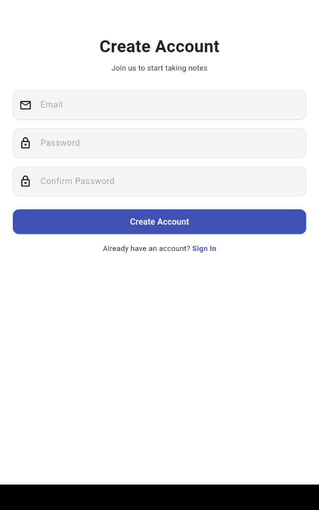
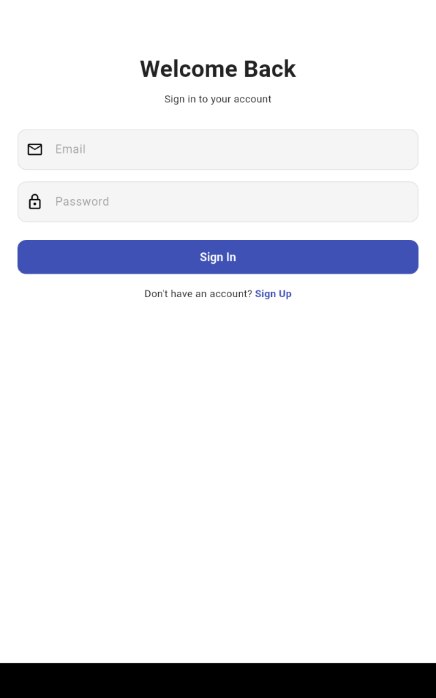
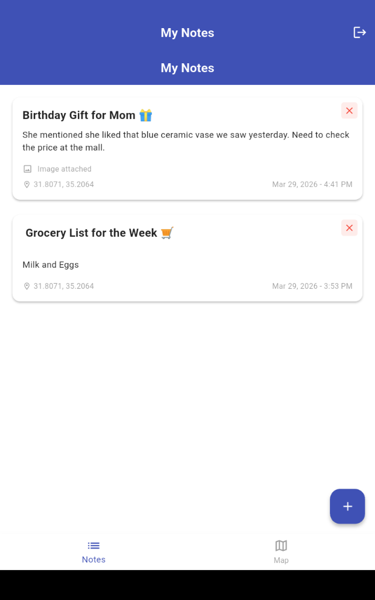
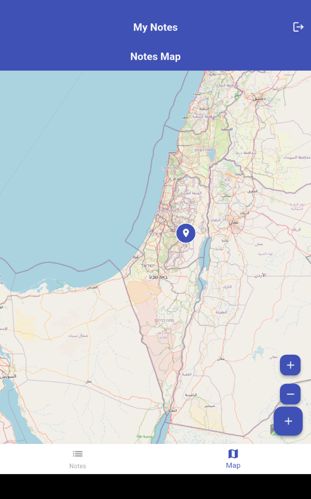
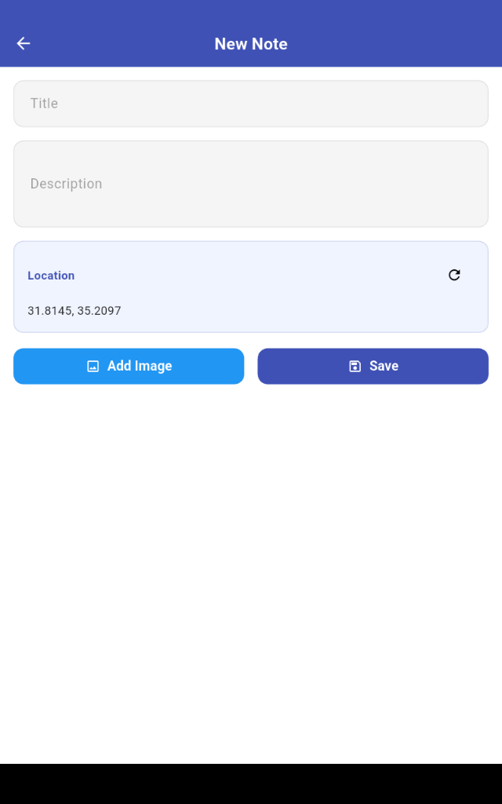

# Location-Based Notes App 

A cross-platform mobile application built with Flutter and Firebase that allows users to create, manage, and visualize notes based on their geographic location.

## Features 
* **Secure Authentication:** Sign up and log in using Firebase Auth.
* **Location-Aware:** Automatically captures the user's coordinates for each note using the device's GPS.
* **Media Integration:** Attach images from the gallery or camera to your notes.
* **Interactive Map:** View all your notes as markers on an interactive map.
* **Real-time Sync:** Powered by Cloud Firestore to keep your notes synced across devices.
* **Offline Ready:** Responsive UI with loading and error states for a smooth user experience.

## Tech Stack 
* **Frontend:** Flutter & Dart
* **Backend:** Firebase (Auth, Firestore, Storage)
* **State Management:** Provider

## Architecture 
The project follows a **Layered Architecture (Repository Pattern)** to ensure scalability and clean code:
* **UI Layer:** Reusable widgets and responsive pages.
* **Business Logic:** ChangeNotifiers (Providers) for state handling.
* **Data Layer:** Repositories and Data Sources for Firebase communication.

## Getting Started 
1. Clone the repository.
2. Run `flutter pub get` to install dependencies.
3. Ensure your Firebase configuration (`google-services.json`) is in the `android/app` folder.
4. Run `flutter run`.

## Screenshots

  
  
  
  
  

